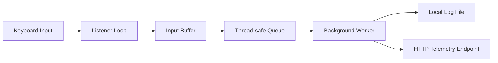

# Keylogger Research Tool

<div align="center">


</div>

> ⚠️ Ethical security research project for authorized lab environments only.

A Python-based research utility built to explore how keyboard input monitoring, local event capture, threaded processing, and remote telemetry transport can be implemented in a controlled, academic setting. This project is designed for studying the underlying mechanics of keylogging behavior without promoting unauthorized exploitation.

---

## Overview

This repository demonstrates a practical research implementation of a keylogging workflow, including:

- keyboard event interception
- event buffering and filtering
- asynchronous queue processing
- local log generation
- basic host metadata collection
- HTTP payload transmission to a configured endpoint

The purpose is to understand the architecture, trade-offs, and defensive implications of telemetry capture systems in a safe and responsible research context.

---

## ⚠️ Disclaimer

This project is intended strictly for:

- authorized penetration testing
- educational exploration
- security research in isolated lab environments
- controlled technical study of telemetry collection systems

It must not be deployed on systems, networks, or accounts without explicit permission from the owner. The author accepts no responsibility for misuse, unauthorized monitoring, or illegal activity.

---

## Core Features

### Keyboard Event Capture
Captures key presses and recognizes both printable characters and special keys like space, enter, backspace, and tab.

### Threaded Processing
Uses a producer/consumer model so key events are queued and processed in the background instead of blocking the listener thread.

### Local Telemetry Logging
Stores timestamped activity in a local temporary log file for lab analysis and evidence review.

### System Fingerprinting
Collects basic machine metadata such as:

- machine identifier
- hostname
- username
- local IP address
- current timestamp

### Remote Endpoint Simulation
Demonstrates how collected strings can be sent to an HTTP endpoint using a configurable webhook-style payload.

---

## System Architecture



---

## Technology Stack

- Python 3
- `pynput` for keyboard event monitoring
- `requests` for HTTP submission
- `threading` for background task execution
- `queue` for safe inter-thread communication
- `socket` for host and network metadata
- `uuid` for machine identification
- `tempfile` for temporary storage
- `datetime` for event timestamping

---

## Project Structure

```text
keylogger-research-tool/
├── Code.js
├── keylogger.py
├── README.md
└── requirements.txt
```

The `Code.js` file is intended for a Google Apps Script endpoint that receives telemetry payloads from the Python research tool.

---

## Installation

Clone the repository:

```bash
git clone https://github.com/XexanTerxcin/keylogger-research-tool.git
cd keylogger-research-tool
```

Install the dependencies:

```bash
pip install -r requirements.txt
```

Example dependency list:

```text
pynput
requests
```

> For the remote endpoint, configure your Google Apps Script URL in the `WEB_APP_URL` constant inside `keylogger.py` and connect it to the logic in `Code.js`.

---

## Lab Usage

Run the script only in an environment you own or have explicit written authorization to test.

Recommended practice:

- use a virtual machine or isolated test system
- generate synthetic input instead of real user data
- avoid capturing passwords, tokens, private messages, or credentials
- use dummy payloads for all experiments

---

## Why This Matters

Keylogging is a powerful and sensitive capability because it can expose:

- passwords
- one-time codes
- personal messages
- API keys
- confidential data

This repository is not meant to enable unauthorized surveillance. It is a technical study of how such systems are built, how they behave, and why defensive controls matter.

---

## Security Considerations

When working with this project:

- never commit captured keystrokes
- never publish real endpoints or credentials
- never store sensitive user data in logs
- use isolated test infrastructure only
- keep all research contained to lab-controlled environments

---

## Educational Takeaways

This project explores several practical software engineering and security concepts:

- event-driven programming
- concurrency and thread safety
- producer/consumer architecture
- HTTP communication patterns
- operating system metadata collection
- endpoint telemetry design
- defensive awareness around monitoring tools
- the ethical boundaries of offensive security research

---

## Responsible Use

Security knowledge is valuable when used to understand, defend, and improve systems.

Use this project to learn, test, and secure — never to violate trust, privacy, or legal boundaries.

---

## Author

**Sk Md Yahya**

Computer Science & Engineering student with interest in:

- cybersecurity
- red teaming
- Linux systems
- Python development
- networking
- electronics
- gaming technology

---

<div align="center">

<strong>Built for research. Built with responsibility.</strong>

</div>
